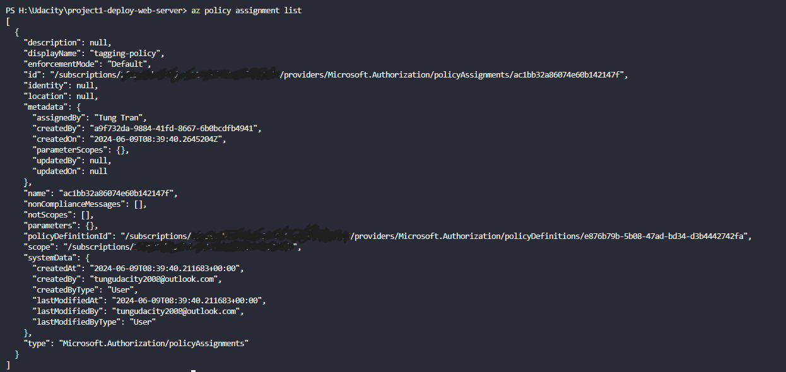
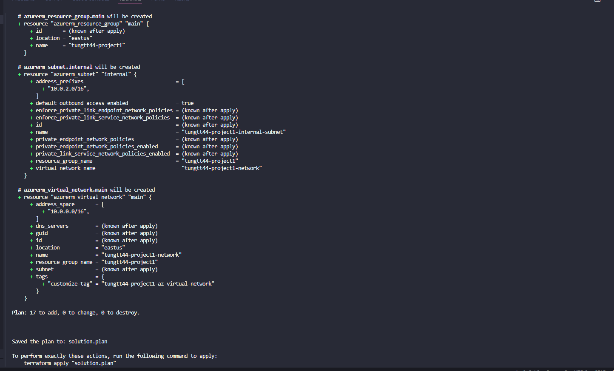
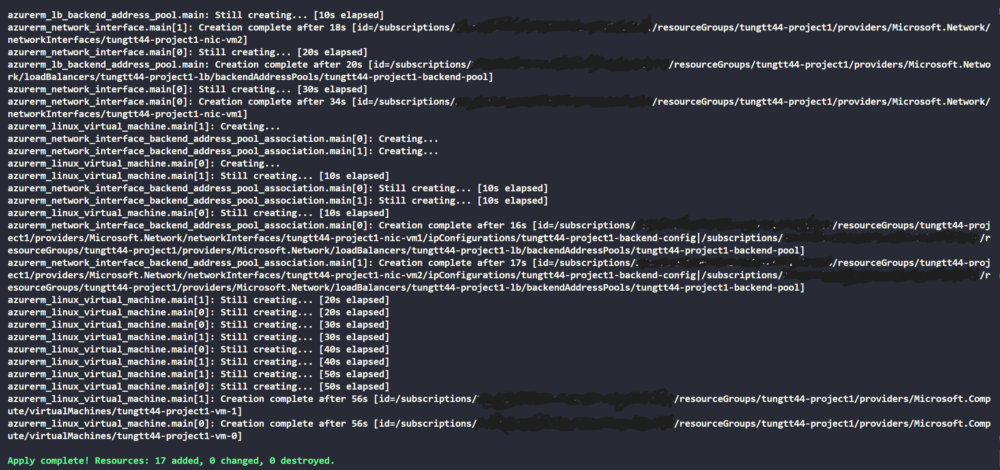

# Azure Infrastructure Operations Project: Deploying a scalable IaaS web server in Azure

### Introduction
For this project, you will write a Packer template and a Terraform template to deploy a customizable, scalable web server in Azure.

### Getting Started
1. Clone this repository

2. Create your infrastructure as code

3. Update this README to reflect how someone would use your code.

### Dependencies
1. Create an [Azure Account](https://portal.azure.com) 
2. Install the [Azure command line interface](https://docs.microsoft.com/en-us/cli/azure/install-azure-cli?view=azure-cli-latest) **v2.61.0**
3. Install [Packer](https://www.packer.io/downloads)  **v1.11.0**
4. Install [Terraform](https://www.terraform.io/downloads.html) **v3.107.0**
5. Recommend install **HashiCorp Terraform** and **Terraform** extension

*Note*: From version packer **v1.7** or later, should run `packer plugins install github.com/hashicorp/azure` to install plugins.

### Instructions
1. Create a policy with a constraint as below (create manually or use az cli to create and assignment)
```
    "policyRule": {
      "if": {
        "allOf": [
          {
            "field": "tags",
            "exists": "false"
          }
        ]
      },
      "then": {
        "effect": "deny"
      }
    }
```
- *Note*: use this command line to verify list policy assignment `az policy assignment list`

2. Create a resource group with a tags `az group create --name <resouce-group-name> --location <location> --tags <key=value>`

3. Create a service principal and assign **Contributor** role `az ad sp create-for-rbac --role Contributor --name <app-name> --scopes subscriptions/<subscriptionId>`

4. Get data from command line above, then create a *.sh contains content below to set environment variable. After that, run `source *.sh`
```
export ARM_CLIENT_ID= appId
export ARM_CLIENT_SECRET= password / Client secrect value
export ARM_SUBSCRIPTION_ID= subscription id
export ARM_TENANT_ID= tenant/ tenant id
```

5. Run command line to assign role to resource group `az role assignment create --assignee $ARM_CLIENT_ID --role Contributor --scope subscriptions/$ARM_SUBSCRIPTION_ID/resourceGroups/<resouce-group-name>`

- *Note*: Run this command to verify `az role assignment list --assignee $ARM_CLIENT_ID --all`

6. First, run `packer validate server.json` to validate template. Then, If everything is good run this command `packer build server.json`

- *Note*: Run `az image list` to verify

7. Create a **vars.tf** file that is where we will defined variables and use it in **main.tf** file. Then, create a **main.tf** file that contains resource, data,...etc. (Highly recommand install extension to suggest complete code, highlight, format...)

8. Run `terraform init` to init terraform configure.
9. Run `terraform plan -out solution.plan`
10. Run `terraform apply soluton.plan`
- *Note*: Run `terraform show` to review
11. Finally, we should delete resouces being used run `terraform destroy`, then, `az image delete -g <resource-group-name> -n <packer-name>`, after that, `az group delete --name <resource-group-name>`

### Output
- Defined and assign policy **tagging-policy**


- Terraform plan


- Apply terraform


